# AgriMate Frontend Technical Documentation

This document provides a comprehensive technical overview of the AgriMate React Native (Expo) frontend codebase, architecture, state management flow, screen structures, and the logistics escrow system.

---

## 🏗️ Architecture Overview

The frontend application uses a context-driven architectural pattern where the global authentication state governs the routing and active screen viewport layout. 

```mermaid
graph TD
    App[App.js] --> AuthProv[AuthContext.js]
    AuthProv --> AppNav[AppNavigator.js]
    
    subgraph Screens & Views
        AppNav --> Login[LoginScreen.js]
        AppNav --> Signup[SignupScreen.js]
        AppNav --> Dash[DashboardScreen.js]
        
        Dash -->|"role == farmer"| Farmer[Farmer Tabs]
        Dash -->|"role == buyer"| Buyer[Buyer Tabs]
        Dash -->|"role == transporter"| Transporter[Transporter Tabs]
        
        subgraph Farmer Tabs
            Farmer --> F_Dash[DashboardTab.js]
            Farmer --> F_List[ListingsTab.js]
            Farmer --> F_Off[OffersTab.js]
            Farmer --> F_Wall[WalletTab.js]
            Farmer --> F_Rate[RatingsTab.js]
            Farmer --> F_Anal[AnalyticsTab.js]
        end

        subgraph Buyer Tabs
            Buyer --> B_Dash[DashboardTab.js]
            Buyer --> B_Mark[MarketplaceTab.js]
            Buyer --> B_Off[OffersTab.js]
            Buyer --> B_Ord[OrdersTab.js]
            Buyer --> B_Pay[PaymentsTab.js]
            Buyer --> B_Rate[RatingsTab.js]
            Buyer --> B_Disp[DisputesTab.js]
            Buyer --> B_Anal[AnalyticsTab.js]
        end

        subgraph Transporter Tabs
            Transporter --> T_Dash[DashboardTab.js]
            Transporter --> T_Jobs[JobsTab.js]
            Transporter --> T_Del[DeliveryTab.js]
            Transporter --> T_Earn[EarningsTab.js]
            Transporter --> T_Wall[WalletTab.js]
            Transporter --> T_Rate[RatingsTab.js]
            Transporter --> T_Anal[AnalyticsTab.js]
        end
        
        Farmer & Buyer & Transporter --> API_Client[src/services/api.js]
    end
```



---

## 📂 Directory Structure

```text
AgriMate-frontend/
├── App.js                       # React application entrypoint (PaperProvider + AuthProvider)
├── app.json                     # Expo configuration manifest (schema, plugins, metadata)
├── eas.json                     # EAS build configurations
├── package.json                 # Project dependencies & launch scripts
└── src/
    ├── context/
    │   └── AuthContext.js       # Global authentication provider (AsyncStorage caching & JWT parse)
    ├── navigation/
    │   └── AppNavigator.js      # App navigation stack switch (Login/Signup ↔ DashboardScreen)
    ├── services/
    │   └── api.js               # Centralized fetch API client wrapper with JWT bearer interceptor
    └── screens/
        ├── LoginScreen.js       # User credentials forms + Apple/Google OAuth simulator
        ├── SignupScreen.js      # Multi-role register forms (Farmer/Buyer/Transporter signup fields)
        ├── DashboardScreen.js   # Master role detector and tab renderer
        │
        ├── farmer/              # 🌾 Farmer Bottom Tab screens
        │   ├── DashboardTab.js  # Main landing stats & shortcuts
        │   ├── ListingsTab.js   # Crop Listings inventory manager (CRUD)
        │   ├── OffersTab.js     # Received buyer bids & Ready-for-pickup fulfillment
        │   ├── WalletTab.js     # MoMo withdrawals & ledger transactions
        │   ├── RatingsTab.js    # Star statistics & replies
        │   └── AnalyticsTab.js  # Performance charts & funnel conversion stats
        │
        ├── buyer/               # 🛒 Buyer Bottom Tab screens
        │   ├── DashboardTab.js  # Spend statistics, quick shortcuts, active tracker
        │   ├── MarketplaceTab.js# Crop marketplace browser & place offer drawer
        │   ├── OffersTab.js     # Bids catalog with edit/cancel abilities
        │   ├── OrdersTab.js     # Escrow funding, release confirmations, self-pickup scans
        │   ├── PaymentsTab.js   # MoMo Deposits drawer & transaction history
        │   ├── RatingsTab.js    # Write and submit seller reviews
        │   ├── DisputesTab.js   # Dispute logging drawer, arbiter refunds, cancellation panel
        │   └── AnalyticsTab.js  # Category distributions & crop prices
        │
        └── transporter/         # 🚚 Transporter Bottom Tab screens
            ├── DashboardTab.js  # Logistics overview dashboard
            ├── JobsTab.js       # Available jobs browser with claim operations
            ├── DeliveryTab.js   # QR Verification scanners (Pickup & Delivery)
            ├── EarningsTab.js   # Earnings statements per job
            ├── WalletTab.js     # Settled funds drawer & withdraw logs
            ├── RatingsTab.js    # Star scorecard feedback
            └── AnalyticsTab.js  # Logistics metrics (hours, completion rates)
```

---

## 🔐 Authentication & Session Flow

The app handles session persistence, token decryption, and roles-based redirection via [AuthContext.js](file:///c:/Users/pc/OneDrive/Desktop/AgriMate-frontend/src/context/AuthContext.js):

1. **State Store**: Maintains `user`, `token`, `isLoading`, and `errorMessage`.
2. **Session Restore**: On mount, reads `userToken` from `AsyncStorage`. If present:
   - Decodes JWT claims (containing user `id`, `fullName`, `username`, `email`, `role`, `region`, and `vehicleNumber` if transporter).
   - Syncs JWT credentials into the [api.js](file:///c:/Users/pc/OneDrive/Desktop/AgriMate-frontend/src/services/api.js) fetch interceptor header.
   - Populates `user` state, causing the app router to immediately navigate to the `Dashboard` screen.
3. **Registration / Login Options**:
   - **Manual Registration**: Submits email, password, username, role, and optional vehicle number plate (mandatory for transporters).
   - **Manual Login**: Validates email/username/phone number and password inputs.
   - **Google / Apple Social Login**: Invokes mock developer modes verifying claims signatures and generating authenticated JWT tokens.

---

## 🌾 Farmer Section Tab System

When the active user's role is `farmer`, [DashboardScreen.js](file:///c:/Users/pc/OneDrive/Desktop/AgriMate-frontend/src/screens/DashboardScreen.js) mounts 6 interactive screens:

### 1. Home / Dashboard Tab
- **API Call**: `api.fetchDashboardSummary()`
- **Purpose**: Home dashboard landing panel. Shows location, quick-access cards for Active Listings, Pending Offers, Wallet Balances, and Ratings, and fast shortcuts.

### 2. Listings Tab
- **API Calls**: `api.fetchListings()`, `api.createListing(cropData)`, `api.updateListing(id, cropData)`, `api.deleteListing(id)`
- **Purpose**: Crop listings inventory CRUD. Supports filtering by Active/Sold and an Add Crop modal.

### 3. Offers Tab
- **API Calls**: `api.fetchOffers()`, `api.acceptOffer(id)`, `api.rejectOffer(id)`, `api.fulfillOrder(id)`
- **Purpose**: Manage received buyer bids. Shows pending bids and active contracts. Clicking "Fulfill" prepares the crop for pickup. Displays a Cargo Pickup QR code containing `agrimate-pickup-${orderId}` for transporters to scan.

### 4. Wallet Tab
- **API Calls**: `api.fetchWalletInfo()`, `api.withdrawFunds(amount, momoNumber)`
- **Purpose**: MoMo cashouts. Supports mobile money withdrawals across networks (MTN, AirtelTigo, Telecel) and shows an audit ledger.

### 5. Ratings Tab
- **API Calls**: `api.fetchRatings()`, `api.replyToRating(id, text)`
- **Purpose**: Engage with feedback. Allows replying to buyer reviews.

### 6. Analytics Tab
- **API Call**: `api.fetchFarmerAnalytics()`
- **Purpose**: MTD Revenue card, completed contracts, avg delivery times, and conversion funnel.

---

## 🛒 Buyer Section Tab System

When the active user's role is `buyer`, [DashboardScreen.js](file:///c:/Users/pc/OneDrive/Desktop/AgriMate-frontend/src/screens/DashboardScreen.js) mounts 8 interactive screens:

### 1. Home / Dashboard Tab
- **API Call**: `api.fetchBuyerDashboardSummary()`
- **Purpose**: Overview of buyer stats: total expenditures, active orders, pending offers, disputes, and wallet balances. Includes an active order tracker.

### 2. Marketplace Tab
- **API Calls**: `api.fetchBuyerListings()`, `api.placeBuyerOffer(offerData)`
- **Purpose**: Browse all active crop listings, view crop grade details, and launch a negotiation drawer to place price bids.

### 3. Offers Tab
- **API Calls**: `api.fetchBuyerOffers()`, `api.updateBuyerOffer(id, offerData)`, `api.cancelBuyerOffer(id)`
- **Purpose**: Catalog of placed offers, showing status updates. Offers can be updated (price/quantity) or cancelled.

### 4. Orders Tab
- **API Calls**: `api.fetchBuyerOrders()`, `api.fundBuyerEscrow(id, amount)`, `api.releaseBuyerEscrow(id)`, `api.selfPickupBuyerOrder(id, pickupToken, vehicleNumber)`
- **Purpose**: Escrow operations on contracted orders:
  - **Fund Escrow**: Locks contract value into the secure vault.
  - **Confirm Delivery**: Releases final funds to the farmer after transporter delivery.
  - **Direct Self-Pickup**: Bypasses the transporter role. The buyer enters their vehicle plate number, scans the farmer's QR code, and triggers an immediate 100% payout release.

### 5. Payments Tab
- **API Calls**: `api.fetchBuyerPayments()`, `api.depositBuyerWallet(amount, momoNumber, provider)`
- **Purpose**: Fund the wallet via MoMo deposits. Displays a list of historic payments and escrow locks.

### 6. Ratings Tab
- **API Calls**: `api.fetchBuyerRatings()`, `api.submitRating(ratingData)`
- **Purpose**: Evaluate farmer performance. Features a star rating selector (1-5) and comment field.

### 7. Disputes Tab
- **API Calls**: `api.fetchBuyerDisputes()`, `api.raiseDispute(disputeData)`, `api.resolveBuyerDispute(id, action)`
- **Purpose**: File disputes for incorrect grades or shipment delays. Enables cancelling a dispute or requesting an arbitrated refund.

### 8. Analytics Tab
- **API Call**: `api.fetchBuyerAnalytics()`
- **Purpose**: Visualizes buying habits: category distribution and cost savings.

---

## 🚚 Transporter Section Tab System

When the active user's role is `transporter`, [DashboardScreen.js](file:///c:/Users/pc/OneDrive/Desktop/AgriMate-frontend/src/screens/DashboardScreen.js) mounts 7 interactive screens:

### 1. Home / Dashboard Tab
- **API Call**: `api.fetchTransporterDashboard()`
- **Purpose**: Overview stats: active deliveries, total completed runs, wallet balances, and rating score.

### 2. Jobs Tab
- **API Calls**: `api.fetchTransporterJobs()`, `api.claimTransporterJob(id)`
- **Purpose**: Delivery opportunities board. Lists shipments marked ready for pickup by farmers, showing routes, cargo weight, and payout values. Transporters claim jobs to add them to their queue.

### 3. Delivery Tab
- **API Calls**: `api.pickupTransporterJob(id, pickupToken)`, `api.deliverTransporterJob(id, deliveryToken)`
- **Purpose**: Verify shipment legs using QR scans:
  - **Leg 1 (Pickup)**: Transporter scans the farmer's QR code (`agrimate-pickup-${orderId}`). Verification triggers a **50% escrow release** to the farmer.
  - **Leg 2 (Delivery)**: Transporter shows a QR code for the buyer to scan, or scans the buyer's QR code (`agrimate-delivery-${orderId}`). Verification triggers the **final 50% release** and marks delivery as complete.

### 4. Earnings Tab
- **API Call**: `api.fetchTransporterEarnings()`
- **Purpose**: Lists payments received for completed shipments and payouts.

### 5. Wallet Tab
- **API Calls**: `api.fetchWalletInfo()`, `api.withdrawFunds(amount, momoNumber)`
- **Purpose**: settled delivery income cashouts via MoMo.

### 6. Ratings Tab
- **API Call**: `api.fetchRatings()`
- **Purpose**: Displays delivery performance feedback.

### 7. Analytics Tab
- **API Call**: `api.fetchTransporterAnalytics()`
- **Purpose**: Metrics including jobs completed, earnings trends, and average delivery times.

---

## 🛡️ Escrow System Mechanics

AgriMate utilizes an escrow model to secure crop deals:
*   **Funds Locked (100%)**: The buyer locks the total value of the listing into escrow using their deposited MoMo wallet balance.
*   **Logistics Delivery Option**:
    *   **Transporter Pickup (50%)**: When the transporter scans the farmer's pickup QR code, **50%** of the crop value is instantly released to the farmer's wallet.
    *   **Transporter Delivery (50% + Delivery Fee)**: When the transporter completes the run and the buyer confirms, the remaining **50%** of the crop value is released to the farmer, and the delivery fee is credited to the transporter.
*   **Self-Pickup Bypass Option**:
    *   If the buyer decides to pick up the crop directly, they skip the transporter queue. The buyer enters their vehicle ID and scans the farmer's pickup QR code. This triggers an immediate **100% release** of escrow funds to the farmer.

---

## 🔌 API Client Service Map

All requests target `http://10.0.2.2:5000` (loopback for Android) or `http://localhost:5000` (iOS). Headers include `Authorization: Bearer <JWT>`.

| Method | Client Function | Endpoint | Description |
| :--- | :--- | :--- | :--- |
| `POST` | `registerUser(userData)` | `/api/users/registerUser` | Multi-role user registration |
| `POST` | `loginUser(credentials)` | `/api/auth/login` | Manual login credentials validator |
| `POST` | `verifyGoogleToken(token)`| `/api/auth/google` | Google sign-in auth check |
| `POST` | `verifyAppleToken(...)`  | `/api/auth/apple` | Apple sign-in auth check |
| `GET`  | `fetchDashboardSummary()`| `/api/dashboard` | Dashboard overview stats (Farmer) |
| `GET`  | `fetchListings()`        | `/api/listings` | Retrieve farmer's listings |
| `POST` | `createListing(data)`    | `/api/listings` | Create crop listing |
| `PUT`  | `updateListing(id, data)`| `/api/listings/:id` | Update crop listing details |
| `DELETE`| `deleteListing(id)`      | `/api/listings/:id` | Remove crop listing details |
| `GET`  | `fetchOffers()`          | `/api/offers` | Fetch received listing bids |
| `POST` | `acceptOffer(id)`        | `/api/offers/:id/accept` | Accept a buyer bid |
| `POST` | `rejectOffer(id)`        | `/api/offers/:id/reject` | Decline a buyer bid |
| `POST` | `fulfillOrder(id)`       | `/api/orders/:id/fulfill` | Mark crop order ready for pickup |
| `GET`  | `fetchWalletInfo()`      | `/api/wallet` | Wallet balances & ledgers |
| `POST` | `withdrawFunds(...)`     | `/api/wallet/withdraw` | MoMo withdrawal payout |
| `GET`  | `fetchRatings()`         | `/api/ratings` | Fetch feedback reviews |
| `POST` | `replyToRating(...)`     | `/api/ratings/:id/reply` | Reply to review (Farmer) |
| `GET`  | `fetchFarmerAnalytics()` | `/api/analytics` | Analytics statistics |
| `GET`  | `fetchBuyerDashboardSummary()`| `/api/buyer/dashboard` | Dashboard summary (Buyer) |
| `GET`  | `fetchBuyerListings()`   | `/api/buyer/listings` | Browse marketplace |
| `GET`  | `fetchBuyerOffers()`     | `/api/buyer/offers` | Placed bids listing |
| `POST` | `placeBuyerOffer(...)`   | `/api/buyer/offers` | Place new bid |
| `PUT`  | `updateBuyerOffer(...)`  | `/api/buyer/offers/:id` | Revise active bid |
| `DELETE`| `cancelBuyerOffer(id)`   | `/api/buyer/offers/:id` | Cancel active bid |
| `GET`  | `fetchBuyerOrders()`     | `/api/buyer/orders` | Active buyer contracts |
| `POST` | `fundBuyerEscrow(...)`   | `/api/buyer/orders/:id/fund` | Lock buyer funds |
| `POST` | `releaseBuyerEscrow(id)` | `/api/buyer/orders/:id/release` | Release remaining 50% |
| `POST` | `selfPickupBuyerOrder(...)` | `/api/buyer/orders/:id/self-pickup` | Self-pickup (100% payout) |
| `POST` | `depositBuyerWallet(...)` | `/api/buyer/wallet/deposit` | MoMo deposit transfer |
| `GET`  | `fetchBuyerPayments()`   | `/api/buyer/payments` | Payments logs |
| `GET`  | `fetchBuyerRatings()`    | `/api/buyer/ratings` | Ratings (Buyer) |
| `POST` | `submitRating(...)`      | `/api/buyer/ratings` | Submit crop rating feedback |
| `GET`  | `fetchBuyerDisputes()`   | `/api/buyer/disputes` | Disputes listing |
| `POST` | `raiseDispute(...)`      | `/api/buyer/disputes` | Raise shipment dispute |
| `POST` | `resolveBuyerDispute(...)`| `/api/buyer/disputes/:id/resolve` | Cancel or Refund dispute |
| `GET`  | `fetchBuyerAnalytics()`  | `/api/buyer/analytics` | Analytics details (Buyer) |
| `GET`  | `fetchTransporterDashboard()`| `/api/transporter/dashboard` | Transporter stats |
| `GET`  | `fetchTransporterJobs()` | `/api/transporter/jobs` | Browse deliveries queue |
| `POST` | `claimTransporterJob(id)`| `/api/transporter/jobs/:id/claim` | Claim cargo job |
| `POST` | `pickupTransporterJob(...)`| `/api/transporter/jobs/:id/pickup` | Scan farmer QR (50% release) |
| `POST` | `deliverTransporterJob(...)`| `/api/transporter/jobs/:id/deliver` | Scan buyer QR (50% release) |
| `GET`  | `fetchTransporterEarnings()`| `/api/transporter/earnings` | Earnings reports |
| `GET`  | `fetchTransporterAnalytics()`| `/api/transporter/analytics` | Logistics performance statistics |

---

## 🚀 Local Setup & Installation

Follow these steps to run both the React Native frontend application and mock backend server locally.

### 1. Prerequisites
- **Node.js**: Version 18+ recommended.
- **Expo Go App**: Installed on your physical Android or iOS device, or an active simulator.

### 2. Backend Server Setup
From the project root:
```bash
cd mock-backend
npm install
node server.js
```
The server will boot on `http://localhost:5000` (or `http://0.0.0.0:5000` for LAN access).

### 3. Frontend App Setup
From the project root:
```bash
npm install
npx expo start
```
- For **Android Emulator**: Press `a`.
- For **iOS Simulator**: Press `i`.
- For **Physical Devices**: Scan the QR code displayed in the terminal using your phone camera (iOS) or the Expo Go app (Android).

---

## 👥 Seed Testing Credentials

You can log in immediately or sign up as a new user. The backend automatically seeds initial wallet balances, listings, and transactions for new accounts based on their selected role.

### Pre-Seeded Profiles:
*   **Farmer (Kofi Mensah)**
    *   **Username**: `kofimensah`
    *   **Password**: `password` (any password is accepted by the mock auth)
*   **Farmer (Ama Serwaa)**
    *   **Username**: `amaserwaa`
    *   **Password**: `password`

### Registering New Accounts:
During registration, select your desired role:
*   **Farmer**: Preloaded with a default crop inventory (Tomato, Corn) and MoMo wallet balance.
*   **Buyer**: Preloaded with `5,000` settled wallet balance to allow immediate marketplace bids and escrow locks.
*   **Transporter**: Registration requires entering a **Vehicle Plate Number** (e.g. `AS-224-22`). 

---

## 🔄 Step-by-Step Logistics Testing Guide

To test the complete lifecycle of a secured crop transaction:

### Step 1: Create a Listing (Farmer)
1. Log in as a **Farmer** (`kofimensah`).
2. Go to the **Listings** tab.
3. Click **Add New Crop** and submit a listing (e.g., `White Yam`, 100 lbs at `2.50` per lb).

### Step 2: Bid and Negotiate (Buyer)
1. Log in as a **Buyer** (or create a new buyer account).
2. Go to the **Marketplace** tab and browse.
3. Find the farmer's listing, click **Place Offer**, adjust the quantities/price in the drawer, and submit.
4. Your bid will now show as `Pending` in your **Offers** tab.

### Step 3: Accept Bid (Farmer)
1. Switch back to the **Farmer** account.
2. Go to the **Offers** tab -> **Pending Bids**.
3. Accept the buyer's bid. The offer is now promoted to an **Active Contract** (awaiting buyer escrow funding).

### Step 4: Fund Escrow (Buyer)
1. Switch back to the **Buyer** account.
2. Go to the **Orders** tab. You will see the new contract marked as **Unfunded**.
3. Click **Fund Escrow**. The crop value is locked from your settled wallet balance into the secure escrow container.

### Step 5: Mark Ready (Farmer)
1. Switch back to the **Farmer** account.
2. Go to the **Offers** tab -> **Active Contracts**.
3. Click **Fulfill Crop**. The crop is marked as ready for transport.

### Step 6: Choose Pickup Path
You can complete the delivery using one of two paths:

#### Path A: Transporter Delivery (50/50 Split)
1. Log in as a **Transporter** (or register one).
2. Go to the **Jobs** tab and click **Claim Job** on the farmer's shipment.
3. Move to the **Delivery** tab.
4. **Pickup Scan**: Scan the QR code generated by the Farmer on their **Offers** tab. This releases **50% of the funds** to the farmer's wallet.
5. **Delivery Scan**: Scan the QR code generated by the Buyer on their **Orders** tab (or let the buyer scan yours). This releases the remaining **50% of the funds** to the farmer, credits the transporter's delivery fee, and marks the shipment as completed.

#### Path B: Direct Self-Pickup (100% Release Bypass)
1. Stay logged in as the **Buyer**.
2. Go to the **Orders** tab.
3. Click **Direct Self-Pickup**.
4. Enter the vehicle plate ID in the input field.
5. Scan the QR code shown on the Farmer's **Offers** tab.
6. The backend verifies the token and immediately releases **100% of the escrow funds** to the farmer, completing the order.

