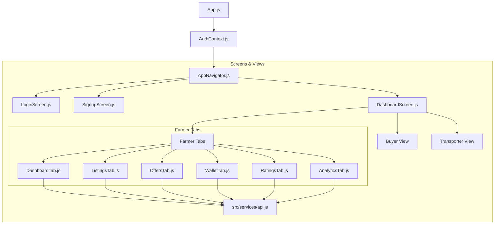

# AgriMate Frontend Technical Documentation

This document provides a comprehensive technical overview of the AgriMate React Native (Expo) frontend codebase, architecture, state management flow, and screen structures.

---

## 🏗️ Architecture Overview

The frontend application uses a context-driven architectural pattern where authentication state governs navigation flow:



---

## 📂 Frontend Directory Structure

```text
AgriMate-frontend/
├── App.js                       # React application entrypoint
├── app.json                     # Expo configuration manifest
├── package.json                 # Project dependencies & startup scripts
└── src/
    ├── context/
    │   └── AuthContext.js       # Global authentication & token caching
    ├── navigation/
    │   └── AppNavigator.js      # App stack navigation (Login/Signup/Dashboard)
    ├── screens/
    │   ├── LoginScreen.js       # Login form & Google/Apple mock integrations
    │   ├── SignupScreen.js      # Register form (Farmer/Buyer/Transporter)
    │   ├── DashboardScreen.js   # Dynamic dashboard router & bottom tab bar
    │   └── farmer/              # Farmer-specific bottom tab screens
    │       ├── DashboardTab.js  # Main landing stats & shortcuts
    │       ├── ListingsTab.js   # Crop CRUD lists & creation modal
    │       ├── OffersTab.js     # Offers desk, escrow acceptances, fulfillment
    │       ├── WalletTab.js     # Balances, Mobile Money withdrawals, transaction logs
    │       ├── RatingsTab.js    # Star metrics & review replies
    │       └── AnalyticsTab.js  # SaaS metrics & listing conversion rates
    └── services/
        └── api.js               # Global fetch API client wrapper
```

---

## 🔐 Authentication & Session Flow

The app handles session persistence, token decryption, and roles-based redirection via [AuthContext.js](file:///c:/Users/pc/OneDrive/Desktop/AgriMate-frontend/src/context/AuthContext.js):

1. **State Store**: Maintains `user`, `token`, `isLoading`, and `errorMessage`.
2. **Session Restore**: On mount, reads `userToken` from `AsyncStorage`. If present:
   - Decodes JWT claims (containing user `id`, `fullName`, `username`, `email`, `role`, `region`, and `vehicleNumber` if transporter).
   - Syncs JWT credentials into the [api.js](file:///c:/Users/pc/OneDrive/Desktop/AgriMate-frontend/src/services/api.js) fetch interceptor header.
   - Populates `user` state, causing the app router to immediately navigate to the `Dashboard` screen.
3. **Registration / Login Options**:
   - **Manual Registration**: Submits email, password, username, role, and optional vehicle number plate (mandatory for transporters).
   - **Manual Login**: Validates email/username/phone number and password inputs.
   - **Google / Apple Social Login**: Invokes mock developer modes verifying claims signatures and generating authenticated JWT tokens.

---

## 🌾 Farmer Section Tab System

When the active user's role is `farmer`, [DashboardScreen.js](file:///c:/Users/pc/OneDrive/Desktop/AgriMate-frontend/src/screens/DashboardScreen.js) mounts a bottom tab navigator with 6 interactive screens:

### 1. Home / Dashboard Tab
- **API Call**: `api.fetchDashboardSummary()`
- **Purpose**: Home dashboard landing panel.
- **Widgets**:
  - Greeting banner displaying current location.
  - Interactive grid cards for **Active Listings**, **Pending Offers**, **Total Balance**, and **Rating Score**. Clicking any stat immediately switches navigation to its corresponding tab.
  - Quick-action shortcuts linking to withdraws and analytics.

### 2. Listings Tab
- **API Calls**: `api.fetchListings()`, `api.createListing(cropData)`, `api.updateListing(id, cropData)`, `api.deleteListing(id)`
- **Purpose**: Manage crop inventories.
- **Controls**:
  - Filter list by *Active* or *Sold* crops.
  - Add Crop modal requesting: *Crop name*, *Quantity (lbs)*, *Price per lb ($)*, *Grade (A/B/C)*, and *Description*.
  - Inline edit and delete buttons for active entries.

### 3. Offers Tab
- **API Calls**: `api.fetchOffers()`, `api.acceptOffer(id)`, `api.rejectOffer(id)`, `api.fulfillOrder(id)`
- **Purpose**: Accept bids and coordinate transit logistics.
- **States**:
  - **Pending Bids**: Displays buyer names, bid amounts, and accept/decline actions.
  - **Active Contracts**: Displays accepted offers where buyer funds are locked in Escrow.
  - **Mark as Ready**: Triggers the logistics transport flow and releases escrow funds directly into the farmer's wallet settled balance.

### 4. Wallet Tab
- **API Calls**: `api.fetchWalletInfo()`, `api.withdrawFunds(amount, momoNumber)`
- **Purpose**: Track earnings and Mobile Money payouts.
- **Features**:
  - **Settled Balance**: Readily available funds.
  - **Escrow Balance**: Locked transit funds.
  - **MoMo Withdrawal**: Modal drawer supporting networks (*MTN*, *AirtelTigo*, *Telecel*), input validation, and instant balance reduction.
  - **Transaction History**: Displays detailed logs showing deposits, locks, and MoMo withdraw cashouts.

### 5. Ratings Tab
- **API Calls**: `api.fetchRatings()`, `api.replyToRating(id, text)`
- **Purpose**: Monitor star feedback and engage with buyers.
- **Features**:
  - Aggregate score banner (e.g., `4.8 / 5.0`) with visual star rendering.
  - Feedback feed from procurement buyers.
  - Inline reply field allowing farmers to reply to reviews, mounting instantly below the review item.

### 6. Analytics Tab
- **API Call**: `api.fetchFarmerAnalytics()`
- **Purpose**: View long-term performance metrics.
- **Widgets**:
  - MTD Revenue earnings card.
  - Metric blocks: total completed contracts, avg delivery time, and offer acceptance rates.
  - Funnel bar displaying the exact conversion rate percentage of listed vs. sold crops.

---

## 🔌 API Client Service Map

All requests target `http://10.0.2.2:5000` (loopback for Android) or `http://localhost:5000` (iOS). Headers include `Authorization: Bearer <JWT>`.

| Method | Client Function | Description |
| :--- | :--- | :--- |
| `POST` | `registerUser(userData)` | Create new user profile (Farmer/Buyer/Transporter) |
| `POST` | `loginUser(credentials)` | Authenticate credentials and retrieve JWT |
| `POST` | `verifyGoogleToken(token)`| Send Google sign-in access token for JWT verification |
| `POST` | `verifyAppleToken(...)`  | Send Apple sign-in identity token for JWT verification |
| `GET`  | `fetchDashboardSummary()`| Fetch overview stats for the landing dashboard |
| `GET`  | `fetchListings()`        | Retrieve crop listings created by active user |
| `POST` | `createListing(data)`    | Create a new crop listing |
| `PUT`  | `updateListing(id, data)`| Update an existing crop listing |
| `DELETE`| `deleteListing(id)`      | Delete a crop listing |
| `GET`  | `fetchOffers()`          | Retrieve offers/bids on farmer crop listings |
| `POST` | `acceptOffer(id)`        | Accept a buyer bid |
| `POST` | `rejectOffer(id)`        | Decline a buyer bid |
| `POST` | `fulfillOrder(id)`       | Mark accepted crop order as ready for pickup |
| `GET`  | `fetchWalletInfo()`      | Retrieve settled/escrow balances and ledger |
| `POST` | `withdrawFunds(...)`     | Request Mobile Money withdrawal transfer |
| `GET`  | `fetchRatings()`         | Retrieve buyer feedback reviews and average score |
| `POST` | `replyToRating(...)`     | Submit a farmer reply response to a buyer review |
| `GET`  | `fetchFarmerAnalytics()` | Retrieve gross earnings and listings funnel stats |
